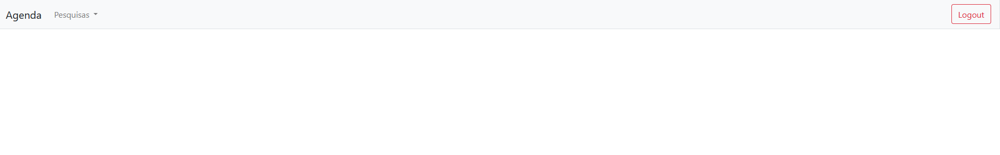
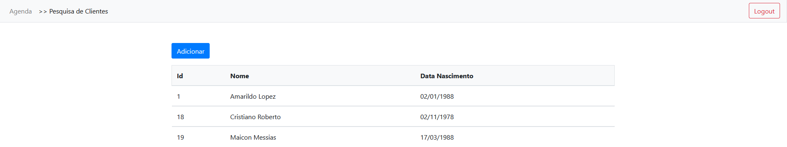
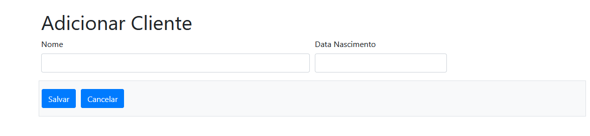
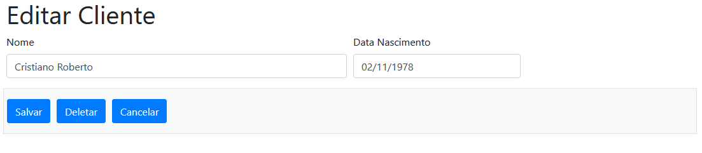
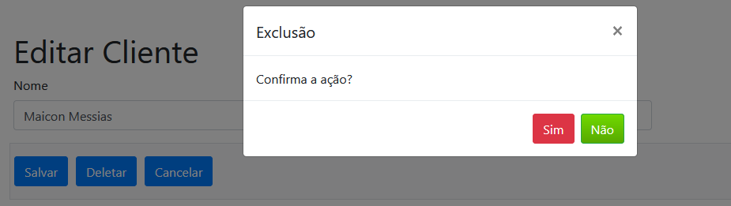

# Contact Book with Django and Python

Project created to implement an Contact Book with Django and Python
Used the sqllite3 database

# Login page with access protection via url

# Simple Main Page

# Search, adiction, inclusion and exclusion page

DB Browser for SQLite https://sqlitebrowser.org/
Django https://www.djangoproject.com/
Python https://www.python.org/ 